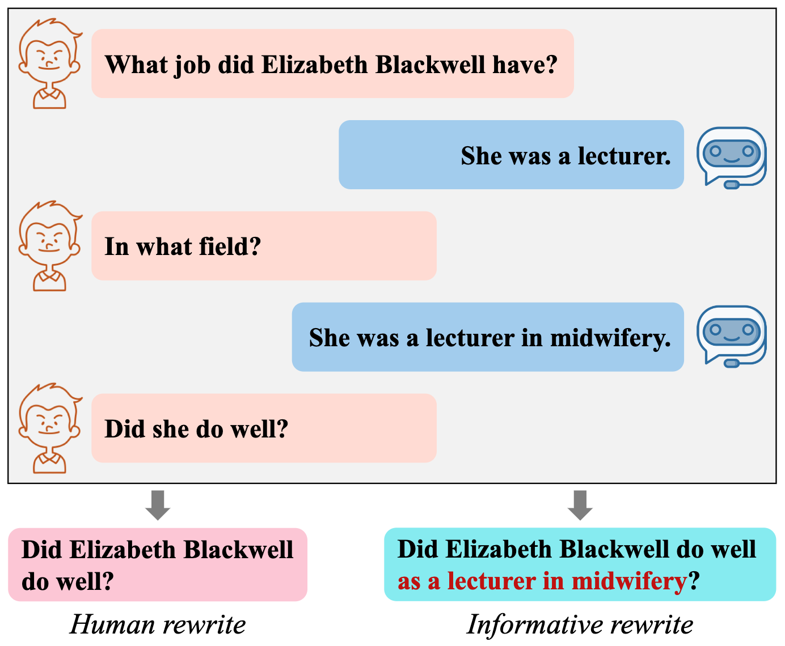
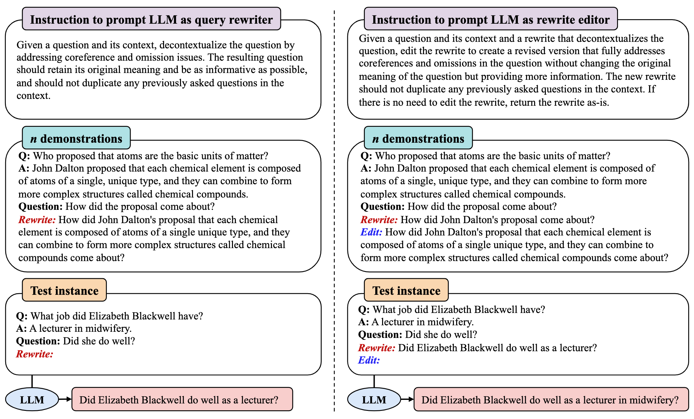
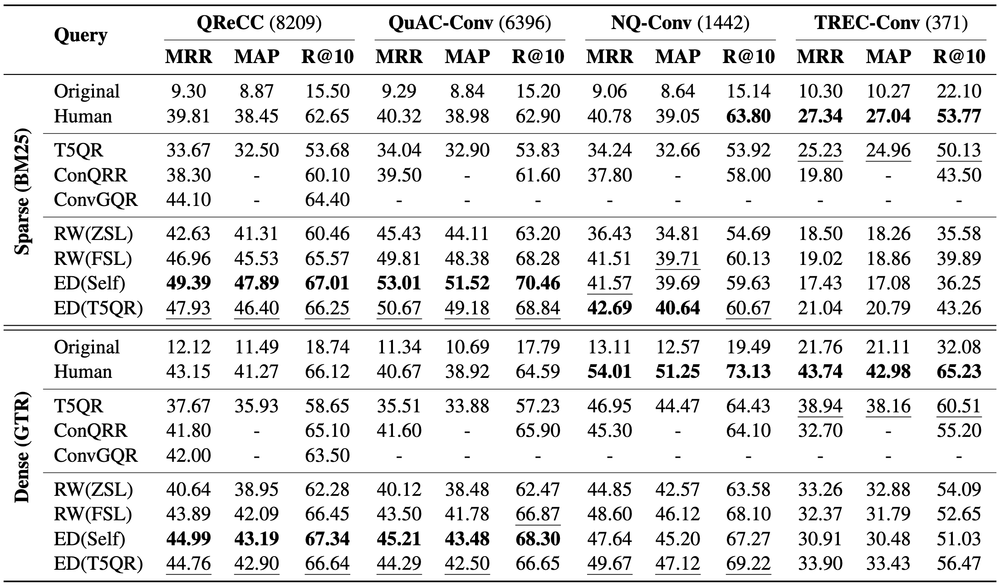

# Enhancing Conversational Search: Large Language Model-Aided Informative Query Rewriting

This [paper](https://aclanthology.org/2023.findings-emnlp.398.pdf) has been accepted at EMNLP Findings 2023.

## Introduction
Query rewriting plays a vital role in enhancing conversational search by transforming context-dependent user queries into standalone forms. Existing approaches primarily leverage human-rewritten queries as labels to train query rewriting models. However, human rewrites may lack sufficient information for optimal retrieval performance. 

<p align="center">
  
  <p align="center">An example showing that human rewrites may overlook valuable contextual information.</p>
</p>

To overcome this limitation, we propose utilizing large language models (LLMs) as query rewriters, enabling the generation of informative query rewrites through well-designed instructions. We define four essential properties for well-formed rewrites and incorporate all of them into the instruction. In addition, we introduce the role of rewrite editors for LLMs when initial query rewrites are available, forming a "rewrite-then-edit" process. Furthermore, we propose distilling the rewriting capabilities of LLMs into smaller models to reduce rewriting latency. Our experimental evaluation on the QReCC dataset demonstrates that informative query rewrites can yield substantially improved retrieval performance compared to human rewrites, especially with sparse retrievers.


## Prompt Design

First, we identify four essential properties that a well-crafted rewritten query should possess:
+ **Correctness:** The rewritten query should preserve the meaning of the original query, ensuring that the user's intent remains unchanged.
+ **Clarity:** The rewritten query should be unambiguous and independent of the conversational context, enabling it to be comprehensible by people outside the conversational context. This clarity can be achieved by addressing coreference and omission issues arising in the original query.
+ **Informativeness:** The rewritten query should incorporate as much valuable and relevant information from the conversational context as possible, thereby providing more useful information to the off-the-shelf retriever.
+ **Nonredundancy:** The rewritten query should avoid duplicating any query previously raised in the conversational context, as it is important to ensure that the rewritten query only conveys the intent and meaning of the current query.

Then, we propose to prompt LLMs as query rewriters and rewrite editors using well-designed instructions that take all four properties into account.
<p align="center">
  
  <p align="center">Our proposed approach involves prompting LLMs as query rewriters and rewrite editors through clear and well-designed instructions, along with appropriate demonstrations. In the absence of demonstrations, the LLM functions as a zero-shot query rewriter. We explicitly incorporate the requirement that rewritten queries should be as informative as possible into the instructions for generating informative query rewrites.</p>
</p>

## Results
We conduct experiments on the [QReCC](https://aclanthology.org/2021.naacl-main.44/) dataset. We rely on passage retrieval performance to assess the usefulness of generated query rewrites.
<p align="center">
  
  <p align="center">Passage retrieval performance of sparse and dense retrievers with various query rewriting methods on the QReCC test set and its three subsets. The best results are shown in bold and the second-best results are underlined.</p>
</p>


## Usage

### Data Preparation
Download the passage collection
```shell
cd cs-shortcut
bash get_dataset.sh
bash data_preprocessing.sh
```

Build a Pyserini index of the passage collection to perform sparse retrieval
```shell
python3 build_pyserini.py \
  --task qrecc \
  --data_path /home/user/InfoCQR/datasets/qrecc \
  --output_path /home/user/InfoCQR/datasets/preprocessed/qrecc
```

Build a dense index of the passage collection based on [GTR](https://huggingface.co/sentence-transformers/gtr-t5-base) to perform dense retrieval
```shell
python3 build_dense_index.py \
  --data_path=/home/user/InfoCQR/datasets/preprocessed \
  --output_path=/home/user/InfoCQR/datasets/preprocessed/qrecc/dense_index \
  --index_batch_size={batch size}
```
or
```shell
python3 build_dense_index_multi_gpus.py \
  --data_path=/home/user/InfoCQR/datasets/preprocessed \
  --output_path=/home/user/InfoCQR/datasets/preprocessed/qrecc/dense_index \
  --index_batch_size={batch size}
```
when multiple GPU cards are available.

### Prompt ChatGPT to Generate Rewrites
Since the first question does not have contextual information, we modify the first question of each conversation to be the human-rewritten query.
```shell
pthon3 dataset_cleaning.py -root_path datasets/qrecc
```

Prompt ChatGPT
```shell
python rewrite_chatgpt_{inctx/zsl/editor/self_editor}.py
```

Post-process rewrites generated by ChatGPT
```shell
python3 fuse_rewrite.py \
  --root_path datasets/qrecc \
  --rw_file {name of rewrite file, e.g., test_chatgpt_ICL.jsonl} \
  --rw_type {rewrite type, e.g., GPT_rewrite}

python3 post_processing.py \
  --root_path datasets/qrecc \
  --rw_file {name of fused rewrite file, e.g., test_fused_ICL.json} \
  --rw_type {rewrite type, e.g., GPT_rewrite}
```

### Perform Retrieval
Sparse retrieval
```shell
python3 BM25.py \
  --task qrecc \
  --split {train/dev/test} \
  --read_by {rewrite type} \
  --raw_data_path datasets \
  --preprocessed_data_path outputs/BM25 \
  --pyserini_index_path datasets/preprocessed/qrecc/pyserini_index \
  --data_file {data file that contains rewrites to be evaluated, e.g., test_fused_ICL_post.json}
```

Dense retrieval
```shell
cd cs-shortcut
python3 run_dense_search.py \
  --task qrecc \
  --split {train/dev/test} \
  --read_by {rewrite type} \
  --raw_data_path /home/user/InfoCQR/datasets \
  --preprocessed_data_path /home/user/InfoCQR/outputs/BM25 \
  --dense_index_path /home/user/InfoCQR/datasets/preprocessed/qrecc/dense_index \
  --data_file {data file that contains rewrites to be evaluated, e.g., test_fused_ICL_post.json}
```


## Acknowledgement 
+ [**cs-shortcut**](https://github.com/naver-ai/cs-shortcut/tree/main)

## Citation
```bibtex
@inproceedings{ye-etal-2023-enhancing,
    title = "Enhancing Conversational Search: Large Language Model-Aided Informative Query Rewriting",
    author = "Ye, Fanghua and Fang, Meng and Li, Shenghui and Yilmaz, Emine",
    booktitle = "Findings of the Association for Computational Linguistics: EMNLP 2023",
    month = dec,
    year = "2023",
    address = "Singapore",
    publisher = "Association for Computational Linguistics",
    url = "https://aclanthology.org/2023.findings-emnlp.398",
    doi = "10.18653/v1/2023.findings-emnlp.398",
    pages = "5985--6006"
}
```
